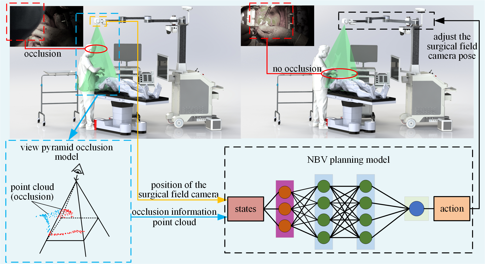

# AutoSurgView

[English](README.md) | [简体中文](README_CN.md)

开放手术记录面临一个长期难题：术者及手术团队会频繁遮挡术野。AutoSurgView 通过持续测量术野遮挡并自主调整相机位姿，帮助恢复清晰、连续的手术视野。

本仓库是论文 *“Autonomous occlusion-aware robotic recording enables continuous visualization of the surgical field in open cardiac surgery”* 的配套代码，包含遮挡感知、基于深度强化学习的视点规划和机器人控制模块。



> **科研软件与安全声明：**本仓库包含物理机器人控制代码，不属于医疗器械，不得直接用于临床。启用执行器前，必须先在仿真环境和隔离测试平台中验证运动范围、急停机制、标定结果与碰撞检测功能。

## 仓库结构

- `robot-controller/`：Windows C++ 机器人控制端，包含感知、视点规划、运动控制和硬件通信代码，原目录名为 `下位机`。
- `operator-console/`：Windows WPF 操作界面，原目录名为 `上位机`。
- `docs/DEPENDENCIES.md`：第三方依赖、厂商 SDK 以及仍然缺少的文件清单。

## 已发布内容

本次发布包含：

- C++ CMake 构建配置；
- WPF `.csproj` 工程文件；
- 机器人控制参数示例；
- 遮挡规避代码实际使用的 ONNX 策略模型；
- 二进制 STL 模型读取代码；
- 相对路径和环境变量配置支持；
- 开源许可证及完整的外部依赖说明。

在物理机器人平台上部署本系统，需要安装 `docs/DEPENDENCIES.md` 中列出的硬件 SDK 和规划依赖。厂商库受其各自许可证约束，需由使用者从官方渠道获取，因此不随本仓库分发。

## 操作界面构建

需要安装 Visual Studio 2022、“.NET 桌面开发”工作负载以及 .NET Framework 4.8 Developer Pack。

```powershell
dotnet restore operator-console/AutoSurgView.OperatorConsole.csproj
dotnet build operator-console/AutoSurgView.OperatorConsole.csproj -c Release
```

摄像机相关功能还需要将已获得合法授权的海康威视 x64 SDK 文件放入 `operator-console/native/`。厂商二进制文件不会提交到 Git。

## 机器人控制端构建

1. 安装 Visual Studio 2022 的“使用 C++ 的桌面开发”工作负载、CMake，以及 `docs/DEPENDENCIES.md` 中列出的开源依赖。
2. 按依赖文档说明，将不能公开分发的头文件和库放入 `robot-controller/vendor/`。
3. 将 `robot-controller/config/parameters.example.txt` 复制为 `parameters.txt`，并根据实际测试平台检查所有参数。
4. 在仓库根目录执行：

```powershell
cmake -S robot-controller -B build/robot-controller
cmake --build build/robot-controller --config Release
```

以下环境变量可以覆盖默认相对路径：

- `AUTOSURGVIEW_CONFIG`：控制参数文件路径；
- `AUTOSURGVIEW_MODEL`：遮挡规避 ONNX 模型路径；
- `AUTOSURGVIEW_LOG_DIR`：运行日志目录。

## 数据与第三方软件

本仓库不分发患者数据、手术录像、账号凭据、设备序列号或专有 SDK 二进制文件。使用者需自行获取所需厂商软件，并遵守所在机构的伦理、隐私、数据安全和第三方许可要求。

## 引用

如果本项目对您的研究有帮助，请引用：

```bibtex
@article{yourname2026autosurgview,
  title   = {Autonomous occlusion-aware robotic recording enables continuous visualization of the surgical field in open cardiac surgery},
  author  = {Haohao Xu¹† and Gang Li¹† and Hao Zhang¹ and Jiongdong Yu¹ and Yueri Cai¹* and Yi Wang² and Ming Gong³ and Hongjia Zhang³},
  journal = {Nature Communications},
  year    = {2026}
}
```

## 许可证

本项目采用 MIT 许可证。第三方开源组件和厂商组件仍受其各自许可证约束。
